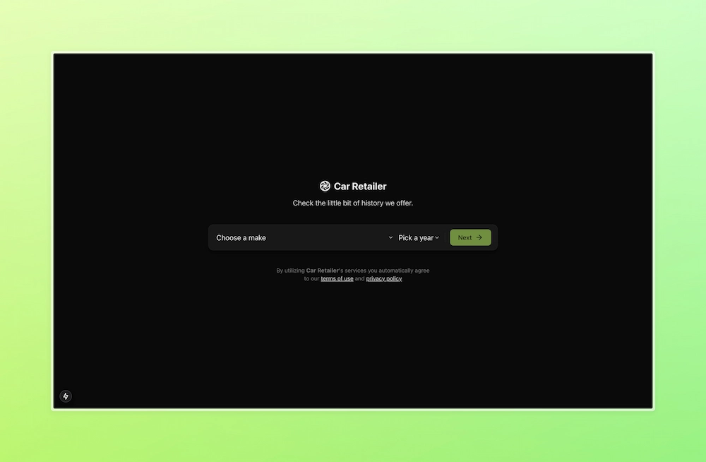
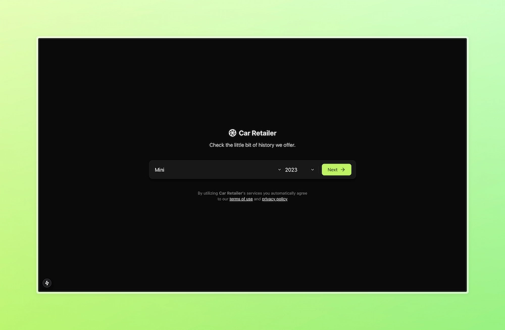
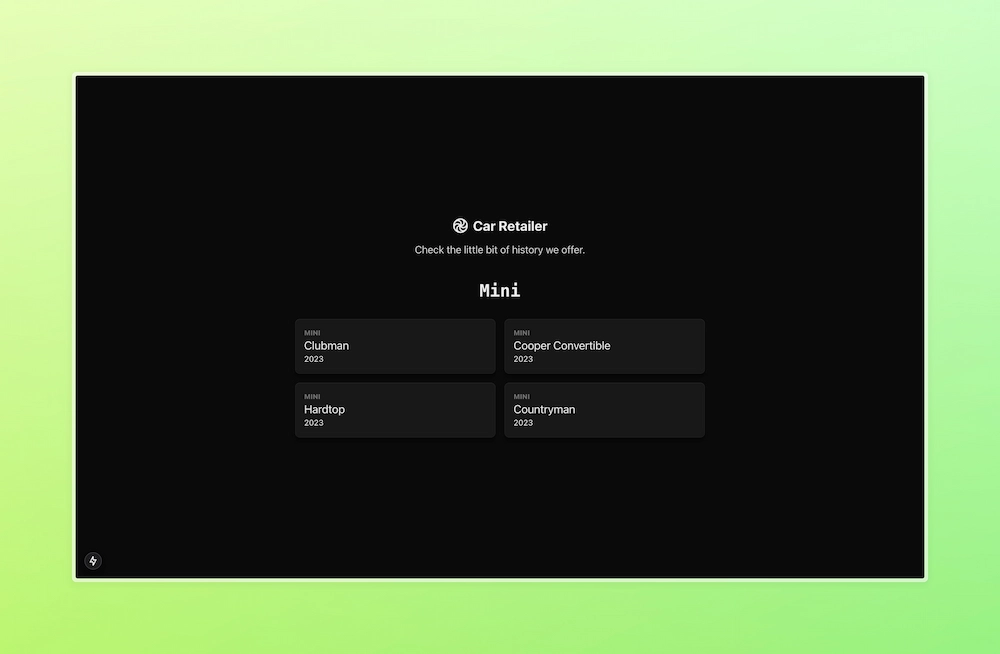

# DevelopsToday Car Retailer

<table>
  <tr>
    <td>Home</td>
     <td>Alowed to go to the next page</td>
     <td>Cars available for the selected search</td>
  </tr>
  <tr>
    <td></td>
    <td></td>
    <td></td>
  </tr>
 </table>

### Overview

- The project allows for users to search for cars based on their make and model year.
  - If one of them is not selected the user is not allowed to go to the next page.
- The routes are statically generated for improved navigation speed and SEO
- The responsive UI was created using TailwindCSS and Lucide for the icons.
- The content of the application is provided by the [United States Department of Transportation API](https://vpic.nhtsa.dot.gov/api/)

### Technologies Used

- Next.js: A React framework for server-side rendering and static site generation.
- React: A JavaScript library for building user interfaces.
- Tailwind CSS: A utility-first CSS framework for rapid UI development.
- TypeScript: A typed superset of JavaScript that compiles to plain JavaScript.
- ESLint: A tool for identifying and fixing problems in JavaScript code.
- Prettier: An opinionated code formatter.
- PostCSS: A tool for transforming CSS with JavaScript plugins.
- Lucide React: A library of icons for React.

### Project Structure

```
.next/
public/
README.md
src/
  app/
  assets/
  components/
  constants/
  data/
  lib/
  types/
  utils/
.env.example
.gitignore
package.json
pnpm-lock.yaml
tailwind.config.ts
tsconfig.json
```

### Key Configuration Files

- `package.json`: Defines the project's dependencies and scripts.
- `tsconfig.json`: Configures TypeScript options.
- `tailwind.config.ts`: Configures Tailwind CSS.
- `postcss.config.mjs`: Configures PostCSS.
- `eslint.config.mjs`: Configures ESLint.
- `.prettierrc`: Configures Prettier.

### Scripts

- `dev`: Starts the development server.
- `build`: Builds the project for production.
- `start`: Starts the production server.
- `lint`: Runs ESLint to check for code quality issues.

### Technical Decisions

- Next.js: Chosen for its ability to handle server-side rendering and static site generation, which improves performance and SEO.
- TypeScript: Used for type safety, which helps catch errors early in the development process.
- Tailwind CSS: Selected for its utility-first approach, which allows for rapid UI development.
- ESLint and Prettier: Integrated for maintaining code quality and consistent formatting.
- PostCSS: Utilized for transforming CSS with JavaScript plugins, enhancing the styling capabilities.

### Getting Started

1. Install dependencies:

```bash
npm install
```

2. Run the development server:

```bash
npm run dev
```

3. Or build the project:

```bash
npm run build
```

4. And start the production server:

```bash
npm run start
```
